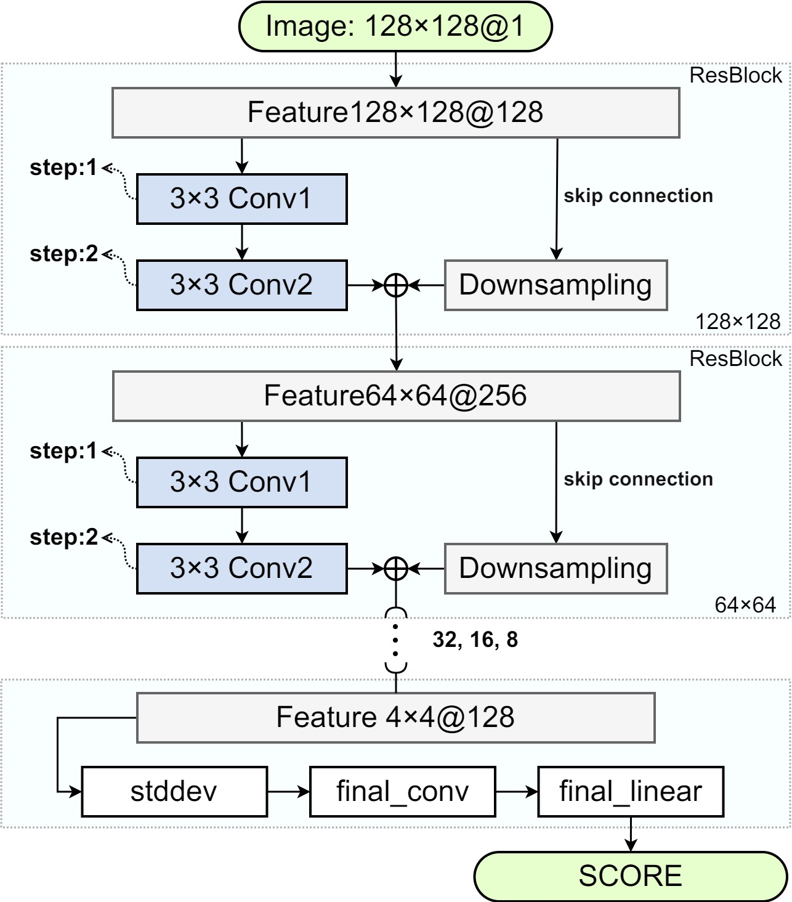

# Conditional StyleGAN2 (条件StyleGAN2)

该程序为条件SetyleGAN2的衍生版本，增加了条件式生成功能，可以有控制地生成复合标签的图像，并在气液两相流中的气泡图像上进行了训练和测试。

## Fork from:
https://github.com/rosinality/stylegan2-pytorch

## Highlight
修改了StyleGAN2的原始网络，实现了条件式生成的功能。

## Improvement
1. 生成器的合成网络（Synthetic Network）中融合了气泡的通过基向量分解的标签信息，表示气泡的长轴长、短轴长、纵横比、圆度（Circularity）、椭圆度（Ellipticity）、灰度中心、阴影比（Shade Ratio）、边缘像素梯度。

2. 使用无标签鉴别器来削弱其能力，进而实现了条件生成的功能。消融实验证明了以上结论。
3. 生成器损失函数使用了交叉熵损失、路径损失外，额外引入了边缘损失和结构相似度损失。鉴别器保持交叉熵损失不变。

## Usage
### 气泡图像生成
generate.py
将气泡的8个结构参数保存到bubble_prompts路径的txt文件中（第一列是文件名），生成器会根据结构参数生成对应的气泡图像。

### 气泡图像融合
generate_fusion.py
实现了不同气泡的特征融合。将四个待融合的气泡放到base_path路径下，程序根据文件名自动查找weights_path路径的csv文件，将四个结构参数向量进行双线性插值后，生成器会生成结构过渡平滑的气泡图像。

## Training
与原生StyleGAN2保持一致。

## Result
在气泡图像生成场景中，条件StyleGAN2在图像质量与结构控制两方面均超过常规的GAN模型。

## Requirements
I have tested on:
numpy==1.24.4
opencv_python==4.10.0.84
pandas==2.0.3
Pillow==11.0.0
torch==2.4.1+cu121
torchvision==0.19.1+cu121
tqdm==4.67.0
wandb==0.19.1

## Reference
[1] Fu, Y., Liu, Y., 2019. BubGAN: Bubble generative adversarial networks for synthesizing realistic bubbly flow images. Chem. Eng. Sci. 204, 35–47. https://doi.org/10.1016/j.ces.2019.04.004

[2] Karras, T., Laine, S., Aila, T., 2019. A Style-Based Generator Architecture for Generative Adversarial Networks. https://doi.org/10.48550/arXiv.1812.04948

[3] Karras, T., Laine, S., Aittala, M., Hellsten, J., Lehtinen, J., Aila, T., 2020. Analyzing and Improving the Image Quality of StyleGAN, in: 2020 IEEE/CVF Conference on Computer Vision and Pattern Recognition (CVPR). Presented at the 2020 IEEE/CVF Conference on Computer Vision and Pattern Recognition (CVPR), IEEE, Seattle, WA, USA, pp. 8107–8116. https://doi.org/10.1109/CVPR42600.2020.00813

[4] Seif, G., Androutsos, D., 2018. Edge-Based Loss Function for Single Image Super-Resolution, in: 2018 IEEE International Conference on Acoustics, Speech and Signal Processing (ICASSP). Presented at the ICASSP 2018 - 2018 IEEE International Conference on Acoustics, Speech and Signal Processing (ICASSP), IEEE, Calgary, AB, pp. 1468–1472. https://doi.org/10.1109/ICASSP.2018.8461664

[5] Wang, Z., Bovik, A.C., Sheikh, H.R., 2004. Image Quality Assessment: From Error Visibility to Structural Similarity. IEEE Trans. IMAGE Process. 13.